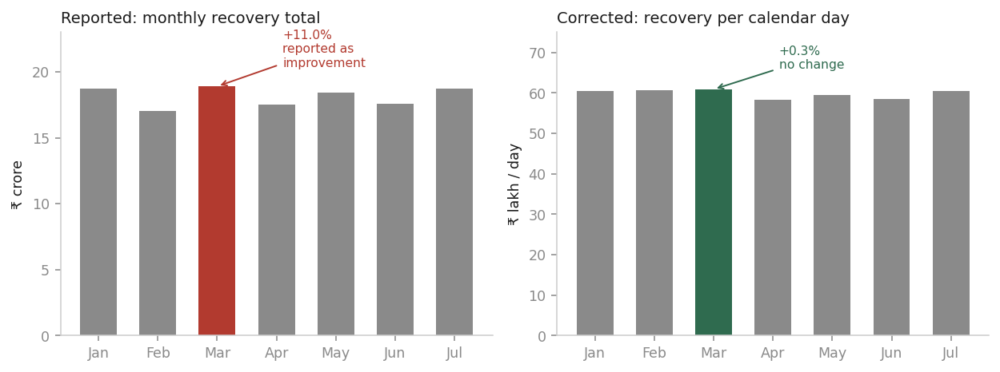
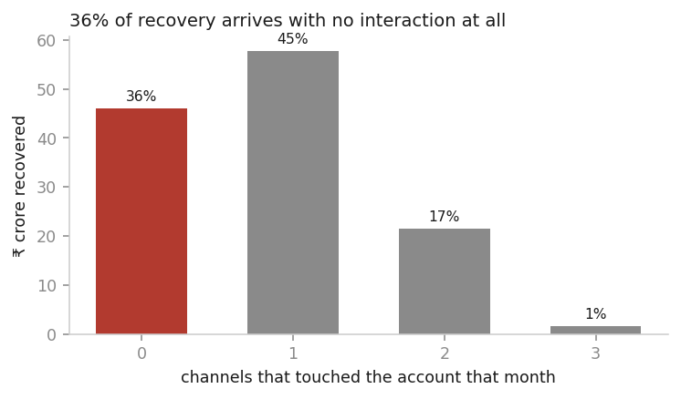

# Collections performance review: the 11% improvement is a calendar artefact

**To:** Leadership **From:** Data Analyst candidate
**Re:** Independent review of reported recovery performance, Jan–Jul 2026

**Bottom line:** Recovery has been flat for seven months. The reported
improvement is arithmetic, not performance. Hold the ₹10 Cr for one quarter.

---

## What happened

Nothing did. That is the finding.

Recovery has held between **₹58.4 and ₹60.9 lakh per operating day** every
month from January to July — a spread of 4.3%. A regression of recovery per
day on time shows no trend (p = 0.33), and none of 14 segments tested trends
individually.

The reported "+11% month-on-month" is the February-to-March comparison.
**February has 28 days, March has 31.** 31 ÷ 28 − 1 = **10.7%**. Regressed
directly, **month length explains 82% of the variance in monthly recovery
totals** (r² = 0.82, p = 0.005).

Normalised per calendar day, that +11.0% becomes **+0.3%**, and series
volatility collapses from a standard deviation of 8.4% to 2.6%.

Two further corrections push the same way. **31.4% of reported payment value
is not recovered money**: ₹56.3 Cr sits in FAILED, PENDING and REVERSED rows
and ₹3.8 Cr in duplicates, out of ₹191.7 Cr. And any figure including August 2026
shows a 74% collapse that did not happen — the data stops on 8 August.

## Why it happened

The improvement was manufactured by the measurement, not the operation.

| Mechanism | Effect on the reported number |
|---|---|
| Comparing raw monthly totals across unequal months | ±11% swing, no operational content |
| Counting failed, pending and reversed payments as recovery | +43% level inflation |
| Duplicate payment rows from ingestion replays and races | +₹3.8 Cr, 500 rows |

We tested every explanatory dimension the brief lists. All come back flat:

| Dimension | Result |
|---|---|
| Portfolio mix | Stable — χ² risk segment p = 0.22, loan type p = 1.00 |
| DPD, borrower segment | Flat across all buckets |
| Cohort / vintage | 2024 and 2025 vintages identical (₹6,030 vs ₹6,052); mix stable, p = 0.13 |
| Telephony vendor | All 15 vendors live every month; connect rate 19.3–20.5%, no switch |
| Attempt frequency | No dose-response; 1–2 attempts pay at 7.9%, 6–9 at 7.7% |
| Calling time | Connect rate 19–21% at *every* hour, including 03:00 |
| Agent capacity | Recovery per agent-hour flat at ₹16.1–17.0 K |
| Denominator | Targeting coverage 77–78% across ACTIVE, PAID, CLOSED, WRITEOFF alike |

Four required dimensions cannot be answered at all. **Client** and **language**
do not exist as columns in any of the 17 tables. **Geography** is unusable
because borrower identity is broken (30,600 rows → 11,015 IDs, 8,468
conflicting). **Agent and agent tenure** are unrecoverable: 1,000 agent IDs,
1,099 employee codes, 10 distinct names.

## How confident we are

| Claim | Basis |
|---|---|
| The +11% is the Feb→Mar calendar difference | **Fact** — month length explains r² = 0.82 |
| Recovery per day is flat Jan–Jul | **Strong** — p = 0.33; 0 of 14 segments trend |
| Non-SUCCESS rows inflate reported recovery ~43% | **Fact** — direct row count |
| Mix, cohort, vendor and denominator are stable | **Strong** — χ² and coverage tests |
| 36% of recovery arrives with no interaction | **Correlation** — real in the data, cause unestablished |
| That 36% is self-cure rather than mis-logged interactions | **Hypothesis** — untested; distinguishing them needs event-level logs we do not have |
| Contact intensity has no effect on recovery | **Hypothesis** — no dose-response observed, but attempt count is endogenous |
| Any specific channel is or is not working | **No basis** |

That last row matters. Of ₹126.9 Cr recovered, **₹46.0 Cr (36%) comes from
accounts with zero calls, messages or visits in the month they paid.** Another
₹23.1 Cr (18%) comes from accounts touched on two or three channels at once.
Only 45% is single-channel, so no attribution window rescues this — last-touch
credits whichever channel fires most often, which measures volume, not effect.

Three further defects constrain the claims: 60% of call records report a
non-zero duration alongside a NO_ANSWER, BUSY or FAILED status; half of all
account status records claim to have been written before the event they
describe; and three mixed timezones put 67% of calls in the wrong hour bucket
uncorrected. Detail in the data quality report; metric definitions and the
challenge to the existing nine are in `reports/metric_definitions.md`.

## What we should do

**Do not deploy the ₹10 Cr on any of the six options yet.** This is a
recommendation, not a refusal — the options differ by less than our
measurement error, so choosing now is choosing at random. Telephony, AI voice
and WhatsApp/digital are channel bets, and channel effect is unmeasurable
here. More agents cannot be sized: agent identity is broken and recovery per
agent-hour has been flat regardless of staffing. Better targeting cannot be
evaluated — the change is not observable and a difference-in-differences
design **fails its parallel-trends test** (p = 0.027) before treatment begins.
Field operations has clean per-unit data but shows no recovery advantage.

There is also no cost table anywhere in this dataset. Every ROI and break-even
figure for those six options would be an invented input dressed as a finding.

### Spend ₹40–60 lakh and one quarter instead

| Step | Cost | Duration | Removes |
|---|---|---|---|
| Fix payment status and dedup logic in reporting | ₹5 L | 2 weeks | The 43% level inflation |
| Switch all reporting to per-operating-day | ₹0 | 1 week | The ±11% calendar artefact |
| Rebuild borrower and agent identity resolution | ₹15–25 L | 6 weeks | Geography and per-agent blindness |
| **Randomised targeting holdout** (10–15% of eligible) | ₹10–15 L | 8 weeks | Attribution guesswork |
| Instrument per-channel cost at account level | ₹10–15 L | 6 weeks | Inability to compute any ROI |

The holdout is the critical one. At ~5,700 targeted accounts per month, eight
weeks yields roughly 1,700 control account-months — enough to detect a 10%
lift at 80% power given observed variance. That costs under 1.5% of the ₹10 Cr.

### The recommendation, against the seven components requested

| Component | Deploy ₹10 Cr now | Spend ₹40–60 L on measurement first |
|---|---|---|
| **Expected incremental recovery** | Unknown. No option's effect is measurable, so the honest estimate is the unweighted average across six — which we cannot compute either | ₹0 directly. The spend buys the ability to choose, not recovery |
| **Estimated cost** | ₹10 Cr | ₹40–60 L (0.4–0.6% of the ₹10 Cr) |
| **Expected ROI** | **Not computable.** No cost table exists in the data — no salary, no per-minute rate, no per-message price | Measured at readout, not assumed |
| **Break-even** | Not computable without a cost base | Break-even at a **0.23–0.28% recovery lift** on the ₹217 Cr annualised run-rate — the lowest bar of any option here |
| **Key assumptions** | That one of six options outperforms, and that the flat seven-month record does not continue | That ~5,700 targeted accounts/month persists; that a holdout is operationally acceptable; that a 10% lift is the minimum worth detecting |
| **Downside scenario** | ₹10 Cr committed against a signal shown to be an artefact of month length. At least two options (more agents, more dialling) have shown flat marginal productivity for seven straight months | One quarter deferred, ~₹2.5 Cr of opportunity cost if a high-return lever exists and we are late to it |
| **Confidence / range** | **Low.** Cannot bound the estimate | **High on the design, not on the outcome.** 8 weeks × ~5,700 accounts × 12.5% holdout ≈ 1,700 control account-months — 80% power to detect a 10% lift at observed variance. The lift itself is what we are measuring, so we do not forecast it |

**If the experiment finds a lever with a 5% lift**, that is roughly **₹9–11 Cr
of incremental annual recovery** against the ₹126.9 Cr seven-month actual,
annualised — repeating every year, against a one-time ₹40–60 L to identify it.

The asymmetry is the argument: measurement costs half a percent of the capital
and is recoverable if wrong. The ₹10 Cr is not.

---

*Every figure here is generated by `pipeline.py` from the raw files with no
manual steps. Method and sensitivity checks are in the notebook; defects and
their treatment are in the data quality report.*
